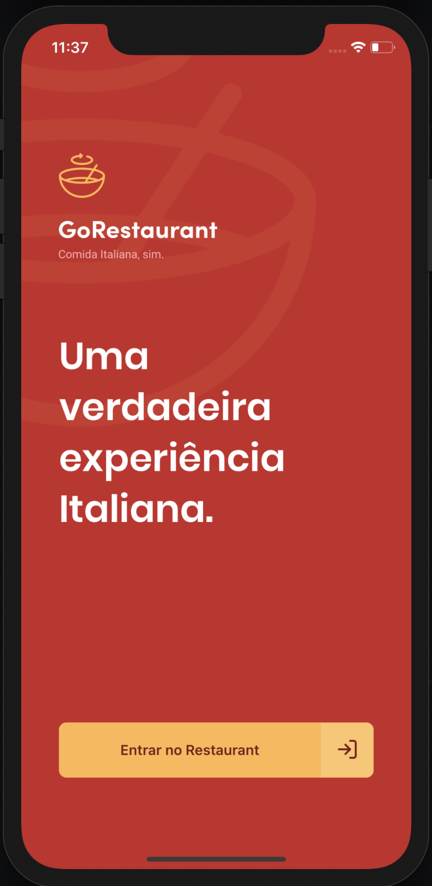

# GoRestaurant Mobile

Desafio de React Native do Bootcamp GoStack [Rocketseat](https://rocketseat.com.br).



## Install
```
git clone https://github.com/nicolastanski/desafio-react-native-delivery
cd desafio-react-native-delivery
yarn
```

### iOS
```
yarn ios
```

### Android
```
yarn android
```


# 📝 Licença

Esse projeto está sob a licença MIT.

---
Codado com 💙 e muito ☕️ por Nicolas Tanski
